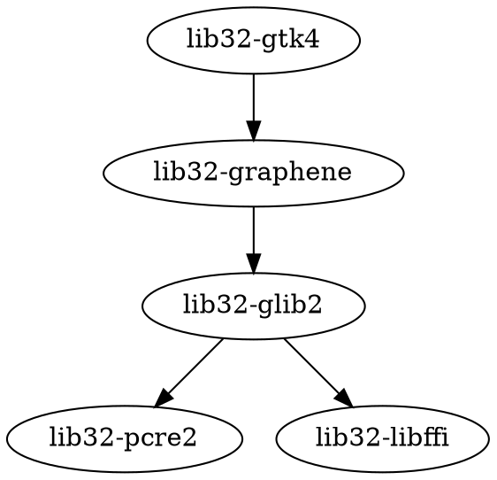

# Scripts Directory

This directory contains build automation, dependency resolution, and utility scripts for the lib32-gtk4 build system.

## Overview

The scripts handle the complex task of building lib32-gtk4 and its dependencies in the correct order, detecting common errors, and applying automatic fixes where possible.

## Script Descriptions

### `build-all.sh`

Main build orchestrator that builds all packages in dependency order.

**Usage:**
```bash
./scripts/build-all.sh [OPTIONS]
```

**Options:**
- `-h, --help` - Show help message
- `-c, --clean` - Clean build directories before building
- `-f, --force` - Force rebuild even if package exists
- `-v, --verbose` - Enable verbose output
- `-j N, --jobs N` - Number of parallel jobs (default: auto)
- `-o DIR, --output DIR` - Output directory for built packages
- `--no-check` - Skip check() function in PKGBUILDs

**Behavior:**
1. Reads dependency graph from `dependencies.conf`
2. Resolves correct build order using topological sort
3. Builds each package in sequence
4. Reports failures with detailed error messages
5. Optionally uploads successful builds to a repository

**Exit Codes:**
- `0` - All packages built successfully
- `1` - Build error occurred
- `2` - Dependency resolution failed
- `3` - Missing required tools

---

### `resolve-deps.sh`

Dependency resolver that determines the correct build order and checks for missing system dependencies.

**Usage:**
```bash
./scripts/resolve-deps.sh [OPTIONS]
```

**Options:**
- `-h, --help` - Show help message
- `-c, --check` - Check installed packages only
- `-g, --graph` - Output dependency graph
- `-l, --list` - List all required packages
- `-m, --missing` - List only missing packages
- `-i, --install` - Generate install commands

**Output Format:**

With `--list`:
```
lib32-libffi
lib32-pcre2
lib32-glib2
lib32-graphene
lib32-gtk4
```

With `--graph` (DOT format):


---

### `detect-errors.sh`

Post-build error analyzer that examines build logs and suggests fixes.

**Usage:**
```bash
./scripts/detect-errors.sh [OPTIONS] [LOG_FILE]
```

**Options:**
- `-h, --help` - Show help message
- `-f, --fix` - Attempt automatic fix
- `-r, --report` - Generate detailed error report
- `-v, --verbose` - Show full error context

**Error Detection Categories:**

| Category | Description | Auto-fix |
|----------|-------------|----------|
| `missing_dep` | Missing build dependency | No |
| `pkg_config` | pkg-config not found | Yes |
| `include_error` | Header file not found | No |
| `link_error` | Library linking failure | No |
| `meson_error` | Meson configuration failure | Sometimes |
| `compiler_error` | C/C++ compilation error | No |

**Output Example:**
```
ERROR [missing_dep]: Package 'gtk4', required by 'gtk4-unix-print', not found
  Location: src/meson.build:45
  Suggestion: Install gtk4 package or check PKG_CONFIG_PATH

ERROR [meson_error]: Dependency "gobject-introspection" not found
  Location: meson.build:127
  Suggestion: Add '-D introspection=disabled' to meson arguments
```

---

### `clean.sh`

Cleanup script to remove all build artifacts.

**Usage:**
```bash
./scripts/clean.sh [OPTIONS]
```

**Options:**
- `-h, --help` - Show help message
- `-a, --all` - Clean everything including cached sources
- `-p, --packages` - Clean built packages only
- `-s, --sources` - Clean source directories only

---

### `verify-packages.sh`

Verification script to check built packages for common issues.

**Usage:**
```bash
./scripts/verify-packages.sh [PACKAGE_FILE]
```

**Checks:**
1. Package metadata validity
2. File permissions
3. Required shared libraries present
4. No conflicting files with system packages
5. Architecture compatibility

---

## Configuration

### `dependencies.conf`

Configuration file defining the dependency graph and build options.

**Format:**
```ini
# Package definitions
[lib32-glib2]
depends = lib32-pcre2, lib32-libffi
aur = https://aur.archlinux.org/lib32-glib2.git

[lib32-graphene]
depends = lib32-glib2
aur = https://aur.archlinux.org/lib32-graphene.git
meson_options = -D introspection=disabled

[lib32-gtk4]
depends = lib32-graphene, lib32-glib2
aur = https://aur.archlinux.org/lib32-gtk4.git
meson_options = -D introspection=disabled -D vapi=disabled
```

---

## Adding New Scripts

When adding new scripts, follow these conventions:

1. Use `bash` shebang: `#!/usr/bin/env bash`
2. Include help text accessible via `-h` or `--help`
3. Use `set -euo pipefail` for error handling
4. Source shared functions from `common.sh`
5. Exit with appropriate codes
6. Add documentation to this README

## Shared Functions

### `common.sh`

Library of shared functions used by multiple scripts.

**Functions:**
- `log_info()` - Print info message
- `log_error()` - Print error message
- `log_success()` - Print success message
- `run_cmd()` - Execute command with logging
- `check_command()` - Verify command exists
- `check_arch()` - Verify multilib is enabled
- `get_pkg_version()` - Extract version from PKGBUILD

## Dependencies

Scripts require these system tools:
- `bash` (>= 5.0)
- `pacman`
- `makepkg`
- `jq` (for JSON parsing)
- `awk`
- `sed`

Install with:
```bash
sudo pacman -S --needed bash pacman-contrib jq gawk sed
```
